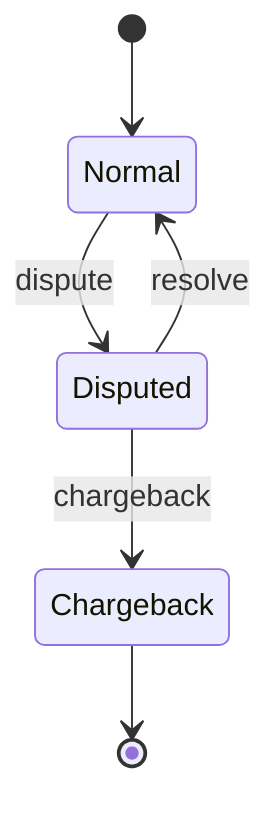

### Run
```
cargo run -- transaction.csv
```

### Assumptions
- allow an account's available balance to go negative in disputes, which the client would need to pay back later
- only deposite transactions can be disputed given the requirement that the funds exchanged in the transaction is moved from the available amount to be held (i.e. locking the deposited funds until the dispute is resolved)
- can we double dispute/chargeback/resolve a transaction?
    - we cannot double chargeback
- a transaction can be disputed more than once, and resolved more than once since resolutions does not result in a change to total account balance, but can only be __chargedback once__ since a chargeback subtracts funds from the account.

### Transaction State Transition Diagram

The transaction state machine used by the engine follows the rules below:
- **Normal** is the default state.
- A transaction can be moved to **Disputed** via `dispute`.
- A disputed transaction can be **resolved** back to **Normal** or **charged back** (terminal state).

